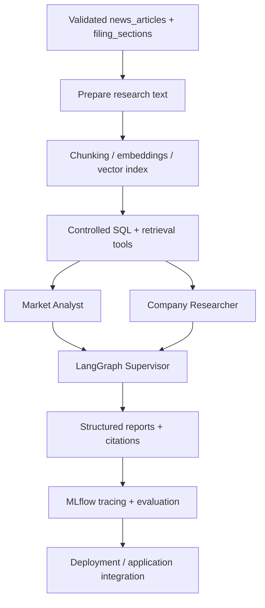

# Multi-Agent Equity Research System on Databricks - Implementation Plan

Build a small research app that compares AAPL and MSFT using market data, company fundamentals, and cited news/filing evidence. See [README.md](README.md) for the architecture and expected output.

**Current position:** Milestone 1. All four Bronze MVP ingestion pipelines are implemented and live-verified in Databricks: prices, news, SEC company facts, and selected SEC 10-K filing documents. The first two Silver slices, `daily_prices` and `news_articles`, are also implemented and live-verified. 121 offline tests now cover configuration, request construction, response parsing, pagination, retries, date windows, SEC access policy, filing selection, Silver price and news validation, deterministic replay/version selection, conflict handling, configured-universe scope rules, and snapshot orchestration. Append-only Bronze provenance is verified for all four Bronze datasets. The Silver price and news snapshots have both been verified to rebuild deterministically without duplicate accumulation or content drift. Remaining Milestone 1 work is primarily Silver company facts and filing sections, Gold metrics, durable operational audit/rejection reporting where required, CI, refresh automation, and deployment verification.

**Next:** Build Silver validation and transformation for SEC company facts, followed by selected filing sections and Item 1 / Item 1A extraction. Continue preserving Bronze as raw retrieval history and keep cleaning, deduplication, version interpretation, and extraction in Silver.

## Implementation roadmap

The project is deliberately split into a trustworthy data-engineering foundation and a grounded AI-engineering layer. Gold is not a one-to-one mirror of Silver: structured price and fundamental data feed analytical Gold tables, while validated news and filing text primarily feed retrieval/indexing assets for the AI system.

### Phase 1 - Data Engineering

### Phase 2 - AI Engineering

## Working approach

For each meaningful step: explain its purpose, implement one coherent piece, test normal behavior and important failures, then record the result and tick the task. Keep teaching and routine diagnostic output in chat. Keep lasting decisions, reproducible checks, and milestone evidence in the repository.

Develop locally, version code and bundle configuration in GitHub, and run deployed workloads in Databricks. A draft or access check is not a working pipeline. Each milestone ends with a tested gate. AI requirements and evaluation examples can be drafted early, but agent implementation depends on a minimum validated data slice.

This structure adapts the [Databricks medallion architecture](https://docs.databricks.com/aws/en/lakehouse/medallion), [CI/CD workflow](https://docs.databricks.com/aws/en/dev-tools/ci-cd/flows), and [agent lifecycle](https://docs.databricks.com/aws/en/agents/agents-dev-lifecycle) to the MVP's scale.

## Phase 0 - Project foundations: complete

- [x] Define the problem, intended user, MVP output, exclusions, and architecture.

- [x] Set up the local repository, GitHub remote, and Databricks development bundle.

- [x] Validate, deploy, and run the serverless Spark smoke test; commit and push the verified checkpoint.

**Gate:** The repository and Databricks deployment path work from recorded commit `e0f8eb5`; [successful smoke-test run](https://dbc-5e700074-422e.cloud.databricks.com/jobs/962241359191284/runs/277255524412899?o=7474654299884940) (workspace access required).

## Milestone 1 - Data Engineering: trustworthy data (in progress)

### Design the data products

- [x] Verify local Alpaca prices/news and SEC directory/company-facts/filing-metadata access; inspect one AAPL filing document.

- [x] Define the source-to-Bronze-to-Silver-to-Gold inventory and review the Bronze price, news, company-facts, and selected-filings contracts in [DATA_CONTRACTS.md](DATA_CONTRACTS.md).

- [x] Define and test the MVP SEC filing-selection rule: configured CIK, exact Form 10-K only, greatest `filingDate`, required metadata, and failure on ambiguous latest candidates. `10-K/A` amendment interpretation is outside the Bronze MVP.

- [ ] Finish Silver filing-version/amendment policy, Item 1 / Item 1A extraction boundaries, extraction-quality rules, and representative transformation tests.

- [x] Create the shared AAPL/MSFT configuration and validated loader; verify the real configuration and configuration-only expansion with four passing offline tests.

### Build the transformations

- [ ] Confirm provider storage, retention, and processing permissions before sustained ingestion. Use synthetic fixtures if permissions remain unresolved.

- [x] Configure development runtime secrets and verify serverless Alpaca and SEC access without exposing credentials.

- [x] Deploy and SQL-verify one bounded Bronze price-response append for AAPL and MSFT; see the [successful development run](https://dbc-5e700074-422e.cloud.databricks.com/jobs/260103230393545/runs/898971715711565?o=7474654299884940) (workspace access required).

- [x] Add reusable price-request construction, response parsing, and bounded cycle-safe pagination with 18 passing offline tests; verify a [two-page development run](https://dbc-5e700074-422e.cloud.databricks.com/jobs/260103230393545/runs/686396093451117?o=7474654299884940) and its continuation-token chain through SQL (workspace access required).

- [x] Add bounded retry and rate-limit handling with deterministic policy tests; verify a [routine retry-enabled development run](https://dbc-5e700074-422e.cloud.databricks.com/jobs/260103230393545/runs/360486532686779?o=7474654299884940) (workspace access required).

- [x] Add configurable backfill and rolling incremental windows with 26 passing offline tests; verify an [incremental run](https://dbc-5e700074-422e.cloud.databricks.com/jobs/260103230393545/runs/1002689227433019?o=7474654299884940) and an identical [safe rerun](https://dbc-5e700074-422e.cloud.databricks.com/jobs/260103230393545/runs/424518002298178?o=7474654299884940) preserved under distinct ingestion IDs (workspace access required).

- [ ] Demonstrate that the first price transformation accepts a third compatible fixture equity without stock-specific pipeline changes; do not expand live scope.

- [x] Build Bronze news ingestion using the same raw-envelope, reusable-client, retry, pagination, and verification conventions.

  - Reusable Alpaca news request/response/pagination logic covered by offline tests.

  - Shared Alpaca HTTP retry policy extracted and reused by price/news ingestion.

  - Backfill and rolling 7-day incremental news windows implemented.

  - `news_responses` stores append-only raw response envelopes with request, pagination, payload-hash, retrieval-time, and ingestion-run provenance.

  - 45 offline tests pass and `databricks bundle validate -t dev` succeeds.

  - Live bounded backfill (AAPL/MSFT, 2026-08-24–2026-08-28, page limit 3): 84 articles across 29 response pages; full continuation-token chain verified; see [backfill run](https://dbc-5e700074-422e.cloud.databricks.com/jobs/752273509776159/runs/541455067040587?o=7474654299884940) (workspace access required).

  - Live incremental run (7-day overlap, page limit 50): 105 articles across 3 pages (50/50/5).

  - Safe rerun verified: identical historical request produced 29/29 identical payload hashes while preserving both runs under distinct ingestion IDs and distinct response IDs; see [rerun](https://dbc-5e700074-422e.cloud.databricks.com/jobs/752273509776159/runs/764960512099615?o=7474654299884940) (workspace access required).

- [x] Build Bronze SEC company-facts ingestion using the same raw-source provenance and conservative access policy.

  - Reusable SEC company-facts request path construction and envelope parsing covered by offline tests.

  - Shared SEC HTTP access policy (identified User-Agent header, minimum 200ms spacing, bounded retry backoff, and identity content encoding where required) implemented in `sec_http.py`.

  - `company_facts_responses` stores append-only raw SEC JSON response snapshots with CIK, entity name, payload hash, retrieval timestamp, and ingestion-run provenance.

  - 59 offline tests passed at completion of the company-facts slice.

  - Live Databricks run appends exactly 2 raw company-facts snapshots for AAPL and MSFT with correct CIK/entity mappings and HTTP 200 OK responses; see [company-facts run](https://dbc-5e700074-422e.cloud.databricks.com/jobs/29449776245070/runs/1091317525267833?o=7474654299884940) (workspace access required).

  - Safe rerun verified: immediate rerun produced identical payload hashes while preserving both runs under distinct ingestion run IDs and response IDs.

- [x] Build Bronze selected SEC filings ingestion using the same raw-source provenance and conservative SEC access conventions.

  - Reusable SEC submissions-path construction, exact 10-K metadata parsing, deterministic latest-filing selection, ambiguity rejection, and archive-document path construction are covered by offline tests.

  - Filing selection is metadata-driven rather than response-order-driven: exact `10-K` only, configured CIK match, greatest `filingDate`, required nonblank accession/report/document metadata, and failure if the latest exact 10-K selection is ambiguous.

  - `10-K/A` is intentionally outside the Bronze MVP selection policy; amendment-aware interpretation belongs in Silver.

  - The deployed job first retrieves and validates selected filings for all configured companies before performing a single append, preventing a partial AAPL-only write if a later retrieval fails.

  - `filing_documents` stores append-only selected SEC filing documents with filing metadata, source URL, request provenance, raw HTML, byte count, raw-response SHA-256, retrieval timestamp, response ID, and ingestion-run ID.

  - SEC submissions metadata is retrieved from `data.sec.gov`; selected primary filing documents are retrieved from `www.sec.gov/Archives` using the configured SEC User-Agent and `requests`, which was live-verified from the Databricks execution environment.

  - 71 offline tests pass, `git diff --check` is clean, and `databricks bundle validate -t dev` succeeds.

  - Live Databricks ingestion appends exactly one selected 10-K document each for AAPL and MSFT with HTTP 200 responses; see the [verified filings run](https://dbc-5e700074-422e.cloud.databricks.com/jobs/1091280341867146/runs/61425458641470?o=7474654299884940) (workspace access required).

  - SQL verification confirms the selected AAPL filing is accession `0000320193-25-000079`, filed 2025-10-31 for period ending 2025-09-27, and the selected MSFT filing is accession `0001193125-26-323660`, filed 2026-07-29 for period ending 2026-06-30.

  - Safe rerun behavior is verified: two successful runs preserve 4 append-only rows under 4 distinct response IDs and 2 distinct ingestion-run IDs while selecting the same accession for each company.

  - Raw SEC HTML responses can vary slightly between retrievals even for the same filing accession. In the verified reruns, document lengths were unchanged and only two small boundary chunks differed for each filing while the document body remained stable. Therefore `response_sha256` records exact retrieval provenance and is not treated as a filing identity or idempotency key.

- [ ] Build Silver validation and deduplication across all four MVP datasets with rejection reporting, safe version selection, and replay tests.
  - [x] Prices: build `daily_prices` from immutable Bronze `price_responses` using exact DECIMAL(20,8) parsing, completed-day and OHLCV validation, configured-universe scope checks, deterministic replay/version selection, same-time conflict failure, and business-key uniqueness.
  - [x] Prices: deploy the bundle-managed Silver schema and `silver_price_transformation` job; live-verify a 10-row AAPL/MSFT snapshot with 2 symbols, zero invalid business rows, and no duplicate business keys. Verified run: https://dbc-5e700074-422e.cloud.databricks.com/jobs/674253274066117/runs/924343723620323?o=7474654299884940
  - [x] Prices: verify a safe rerun produces the same 10-row snapshot and SHA-256 `c31167d5c1bfa3a25e909523f9b3889e3fa4f133922f8dd92f6b68f0a0c2ea80`. Verified rerun: https://dbc-5e700074-422e.cloud.databricks.com/jobs/674253274066117/runs/174807465777710?o=7474654299884940
  - [ ] Prices: persist durable transformation-run audit/rejection details if required beyond the currently tested rule reasons and aggregate counts.
  - [x] News: build `news_articles` from immutable Bronze `news_responses` with article-level validation, BIGINT article IDs, timestamp and citation-URL checks, optional-text handling, deterministic latest-valid-revision selection by `article_updated_at`, selected-version conflict failure, and configured-symbol relationships derived only after version selection.
  - [x] News: deploy the bundle-managed `silver_news_transformation` job and live-verify a 150-row snapshot with 150 distinct article IDs, zero invalid business rows, no duplicate business keys, and zero configured-universe scope violations. Verified run: https://dbc-5e700074-422e.cloud.databricks.com/jobs/859797368121284/runs/891515634779290?o=7474654299884940
  - [x] News: verify a safe rerun produces an identical 150-row snapshot. Delta versions 0 and 1 have zero rows in either directional `EXCEPT ALL` comparison. Verified rerun: https://dbc-5e700074-422e.cloud.databricks.com/jobs/859797368121284/runs/407427103933376?o=7474654299884940
  - [ ] News: persist durable transformation-run audit/rejection details if required beyond the currently tested rule reasons and aggregate counts.
  - [ ] Implement Silver company-facts transformation and its snapshot/version/replay rules.
  - [ ] Implement Silver filing-section transformation, amendment/version interpretation, and Item 1 / Item 1A extraction rules.

- [ ] Define comparable periods and filing versions; build Gold market and fundamental metrics with clear `as_of` timestamps and coverage limits.

### Automate and verify

- [ ] Add GitHub Actions CI for formatting, linting, contract/unit tests, and bundle validation on pull requests and `main`; no live credentials required.

- [ ] Configure initial backfills and scheduled incremental refreshes; verify quality, freshness, missing-data reporting, failure visibility, and safe reruns.

- [ ] Add controlled deployment from a CI-tested `main` commit: deploy the bundle to `dev`, run verification, and record the commit/run link. Use a documented manual CLI fallback if Free Edition cannot authenticate unattended.

**Gate:** AAPL and MSFT can be rebuilt from Bronze into tested Silver and Gold outputs. Data quality, replay, freshness, CI, and deployment checks pass, and code deployment remains separate from scheduled data refresh.

**Expansion rule:** Ingestion, scope checks, analytics, tools, and UI use the same equities configuration. Adding a compatible stock requires configuration plus identifier, backfill, and readiness checks—not stock-specific pipeline code. Provider news tags never expand the universe automatically.

## Milestone 2 - AI Engineering: grounded research (pending)

- [ ] Define the report structure, agent responsibilities, important failure behavior, and a small representative evaluation set.

- [ ] Confirm indexing/model-processing permissions; prepare cleaned news/filing documents, chunks, metadata, and a vector index.

- [ ] Build and independently test controlled SQL and retrieval tools that check configured symbols and data readiness.

- [ ] Implement the Market Analyst, Company Researcher, and LangGraph Supervisor with structured reports, citations, and clear errors.

- [ ] Add MLflow tracing and evaluate numerical correctness, retrieval relevance, citation support, missing/stale evidence, tool routing, latency, and cost.

- [ ] Correct measured weaknesses and rerun the same evaluations to check for regressions.

- [ ] Extend CI with deterministic tool tests and offline evaluations; run credentialed live-model evaluations separately with controlled usage.

**Gate:** Representative one-stock and comparison requests produce grounded reports: numbers match Gold, narrative claims have supporting citations, and missing or stale evidence is disclosed.

## Milestone 3 - Application and end-to-end delivery (pending)

- [ ] Build configured stock/period selection, charts, comparison metrics, a cited report, and evidence-grounded follow-up chat.

- [ ] Add application logging, monitoring, feedback collection, and secure secret handling.

- [ ] Confirm public display/redistribution permissions for provider data and derived outputs; use clearly labelled synthetic demo data if unresolved.

- [ ] Deploy the app on Databricks and extend controlled deployment with startup, health, and end-to-end verification.

- [ ] Add screenshots, example output, a short demo, and concise reproduction instructions covering CI, authentication, release checks, and redeploying a known-good version.

**Gate:** An intended user can access the deployed app, research one supported stock or compare both, inspect citations, and follow the repository's reproduction/deployment instructions. Access requirements and Free Edition limitations are explicit.

## Outside the MVP

Broader live stock coverage, sentiment scoring, GDELT, cTrader, live Alpaca MCP, price prediction, portfolio optimization, and trading execution.