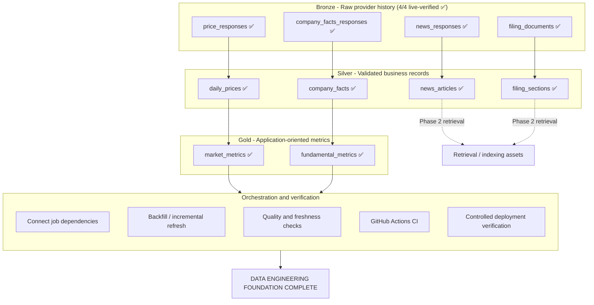
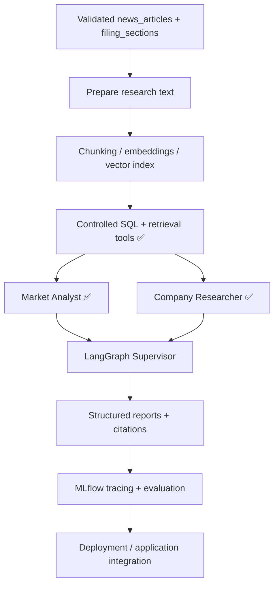

# Multi-Agent Equity Research System on Databricks - Implementation Plan

Build a small research app that compares AAPL and MSFT using market data, company fundamentals, and cited news/filing evidence. See [README.md](README.md) for the architecture and expected output.

**Current position:** Milestone 1 — Data Engineering is complete and Milestone 2 — AI Engineering is active. The deterministic RAG corpus, managed embeddings/vector index, independent retrieval holdout, controlled structured-data/retrieval tools, and both worker agents are implemented and live-verified in Databricks. The Market Analyst consumes only controlled ready Gold metrics and returns findings whose symbols, dimensions, metric fields, and exact as-of dates are validated deterministically. The Company Researcher consumes only controlled retrieval evidence, treats retrieved text as untrusted, preserves supplied evidence IDs, distinguishes company developments from irrelevant market/personnel activity, and distinguishes SEC-disclosed risks from news-based risk context. Both workers use the Unity Catalog model service `system.ai.gpt-oss-20b` through structured JSON output, followed by application-side validation. Credential-free GitHub Actions continues to run Ruff correctness lint and the offline test suite on pull requests and pushes to `main`.

**Next:** Implement and independently test the LangGraph Supervisor over the verified worker-agent interfaces, then add structured report/citation validation and MLflow tracing/evaluation.

## Implementation roadmap

The project is deliberately split into a trustworthy data-engineering foundation and a grounded AI-engineering layer. Gold is not a one-to-one mirror of Silver: structured price and fundamental data feed analytical Gold tables, while validated news and filing text primarily feed retrieval/indexing assets for the AI system.

### Phase 1 - Data Engineering

### Phase 2 - AI Engineering

## Working approach

For each meaningful step: explain its purpose, implement one coherent piece, test normal behavior and important failures, then record the result and tick the task. Keep teaching and routine diagnostic output in chat. Keep lasting decisions, reproducible checks, and milestone evidence in the repository.

Develop locally, version code and bundle configuration in GitHub, and run deployed workloads in Databricks. A draft or access check is not a working pipeline. Each milestone ends with a tested gate. AI requirements and evaluation examples can be drafted early, but agent implementation depends on a minimum validated data slice.

This structure adapts the [Databricks medallion architecture](https://docs.databricks.com/aws/en/lakehouse/medallion), [CI/CD workflow](https://docs.databricks.com/aws/en/dev-tools/ci-cd/flows), and [agent lifecycle](https://docs.databricks.com/aws/en/agents/agents-dev-lifecycle) to the MVP's scale.

## Phase 0 - Project foundations: complete

- [x] Define the problem, intended user, MVP output, exclusions, and architecture.

- [x] Set up the local repository, GitHub remote, and Databricks development bundle.

- [x] Validate, deploy, and run the serverless Spark smoke test; commit and push the verified checkpoint.

**Gate:** The repository and Databricks deployment path work from recorded commit `e0f8eb5`; [successful smoke-test run](https://dbc-5e700074-422e.cloud.databricks.com/jobs/962241359191284/runs/277255524412899?o=7474654299884940) (workspace access required).

## Milestone 1 - Data Engineering: trustworthy data (complete)

### Design the data products

- [x] Verify local Alpaca prices/news and SEC directory/company-facts/filing-metadata access; inspect one AAPL filing document.

- [x] Define the source-to-Bronze-to-Silver-to-Gold inventory and review the Bronze price, news, company-facts, and selected-filings contracts in [DATA_CONTRACTS.md](DATA_CONTRACTS.md).

- [x] Define and test the MVP SEC filing-selection rule: configured CIK, exact Form 10-K only, greatest `filingDate`, required metadata, and failure on ambiguous latest candidates. `10-K/A` amendment interpretation is outside the Bronze MVP.

- [x] Finish Silver filing-version/amendment policy, Item 1 / Item 1A extraction boundaries, extraction-quality rules, and representative transformation tests.

- [x] Create the shared AAPL/MSFT configuration and validated loader; verify the real configuration and configuration-only expansion with four passing offline tests.

### Build the transformations

- [ ] Confirm provider storage, retention, and processing permissions before sustained ingestion. Use synthetic fixtures if permissions remain unresolved.

- [x] Configure development runtime secrets and verify serverless Alpaca and SEC access without exposing credentials.

- [x] Deploy and SQL-verify one bounded Bronze price-response append for AAPL and MSFT; see the [successful development run](https://dbc-5e700074-422e.cloud.databricks.com/jobs/260103230393545/runs/898971715711565?o=7474654299884940) (workspace access required).

- [x] Add reusable price-request construction, response parsing, and bounded cycle-safe pagination with 18 passing offline tests; verify a [two-page development run](https://dbc-5e700074-422e.cloud.databricks.com/jobs/260103230393545/runs/686396093451117?o=7474654299884940) and its continuation-token chain through SQL (workspace access required).

- [x] Add bounded retry and rate-limit handling with deterministic policy tests; verify a [routine retry-enabled development run](https://dbc-5e700074-422e.cloud.databricks.com/jobs/260103230393545/runs/360486532686779?o=7474654299884940) (workspace access required).

- [x] Add configurable backfill and rolling incremental windows with 26 passing offline tests; verify an [incremental run](https://dbc-5e700074-422e.cloud.databricks.com/jobs/260103230393545/runs/1002689227433019?o=7474654299884940) and an identical [safe rerun](https://dbc-5e700074-422e.cloud.databricks.com/jobs/260103230393545/runs/424518002298178?o=7474654299884940) preserved under distinct ingestion IDs (workspace access required).

- [ ] Demonstrate that the first price transformation accepts a third compatible fixture equity without stock-specific pipeline changes; do not expand live scope.

- [x] Build Bronze news ingestion using the same raw-envelope, reusable-client, retry, pagination, and verification conventions.

  - Reusable Alpaca news request/response/pagination logic covered by offline tests.

  - Shared Alpaca HTTP retry policy extracted and reused by price/news ingestion.

  - Backfill and rolling 7-day incremental news windows implemented.

  - `news_responses` stores append-only raw response envelopes with request, pagination, payload-hash, retrieval-time, and ingestion-run provenance.

  - 45 offline tests pass and `databricks bundle validate -t dev` succeeds.

  - Live bounded backfill (AAPL/MSFT, 2026-08-24–2026-08-28, page limit 3): 84 articles across 29 response pages; full continuation-token chain verified; see [backfill run](https://dbc-5e700074-422e.cloud.databricks.com/jobs/752273509776159/runs/541455067040587?o=7474654299884940) (workspace access required).

  - Live incremental run (7-day overlap, page limit 50): 105 articles across 3 pages (50/50/5).

  - Safe rerun verified: identical historical request produced 29/29 identical payload hashes while preserving both runs under distinct ingestion IDs and distinct response IDs; see [rerun](https://dbc-5e700074-422e.cloud.databricks.com/jobs/752273509776159/runs/764960512099615?o=7474654299884940) (workspace access required).

- [x] Build Bronze SEC company-facts ingestion using the same raw-source provenance and conservative access policy.

  - Reusable SEC company-facts request path construction and envelope parsing covered by offline tests.

  - Shared SEC HTTP access policy (identified User-Agent header, minimum 200ms spacing, bounded retry backoff, and identity content encoding where required) implemented in `sec_http.py`.

  - `company_facts_responses` stores append-only raw SEC JSON response snapshots with CIK, entity name, payload hash, retrieval timestamp, and ingestion-run provenance.

  - 59 offline tests passed at completion of the company-facts slice.

  - Live Databricks run appends exactly 2 raw company-facts snapshots for AAPL and MSFT with correct CIK/entity mappings and HTTP 200 OK responses; see [company-facts run](https://dbc-5e700074-422e.cloud.databricks.com/jobs/29449776245070/runs/1091317525267833?o=7474654299884940) (workspace access required).

  - Safe rerun verified: immediate rerun produced identical payload hashes while preserving both runs under distinct ingestion run IDs and response IDs.

- [x] Build Bronze selected SEC filings ingestion using the same raw-source provenance and conservative SEC access conventions.

  - Reusable SEC submissions-path construction, exact 10-K metadata parsing, deterministic latest-filing selection, ambiguity rejection, and archive-document path construction are covered by offline tests.

  - Filing selection is metadata-driven rather than response-order-driven: exact `10-K` only, configured CIK match, greatest `filingDate`, required nonblank accession/report/document metadata, and failure if the latest exact 10-K selection is ambiguous.

  - `10-K/A` is intentionally outside the Bronze MVP selection policy; amendment-aware interpretation belongs in Silver.

  - The deployed job first retrieves and validates selected filings for all configured companies before performing a single append, preventing a partial AAPL-only write if a later retrieval fails.

  - `filing_documents` stores append-only selected SEC filing documents with filing metadata, source URL, request provenance, raw HTML, byte count, raw-response SHA-256, retrieval timestamp, response ID, and ingestion-run ID.

  - SEC submissions metadata is retrieved from `data.sec.gov`; selected primary filing documents are retrieved from `www.sec.gov/Archives` using the configured SEC User-Agent and `requests`, which was live-verified from the Databricks execution environment.

  - 71 offline tests pass, `git diff --check` is clean, and `databricks bundle validate -t dev` succeeds.

  - Live Databricks ingestion appends exactly one selected 10-K document each for AAPL and MSFT with HTTP 200 responses; see the [verified filings run](https://dbc-5e700074-422e.cloud.databricks.com/jobs/1091280341867146/runs/61425458641470?o=7474654299884940) (workspace access required).

  - SQL verification confirms the selected AAPL filing is accession `0000320193-25-000079`, filed 2025-10-31 for period ending 2025-09-27, and the selected MSFT filing is accession `0001193125-26-323660`, filed 2026-07-29 for period ending 2026-06-30.

  - Safe rerun behavior is verified: two successful runs preserve 4 append-only rows under 4 distinct response IDs and 2 distinct ingestion-run IDs while selecting the same accession for each company.

  - Raw SEC HTML responses can vary slightly between retrievals even for the same filing accession. In the verified reruns, document lengths were unchanged and only two small boundary chunks differed for each filing while the document body remained stable. Therefore `response_sha256` records exact retrieval provenance and is not treated as a filing identity or idempotency key.

- [x] Build Silver validation and deduplication across all four MVP datasets with explicit validation diagnostics, safe version selection, and replay tests.
  - [x] Prices: build `daily_prices` from immutable Bronze `price_responses` using exact DECIMAL(20,8) parsing, completed-day and OHLCV validation, configured-universe scope checks, deterministic replay/version selection, same-time conflict failure, and business-key uniqueness.
  - [x] Prices: deploy the bundle-managed Silver schema and `silver_price_transformation` job; live-verify a 10-row AAPL/MSFT snapshot with 2 symbols, zero invalid business rows, and no duplicate business keys. Verified run: https://dbc-5e700074-422e.cloud.databricks.com/jobs/674253274066117/runs/924343723620323?o=7474654299884940
  - [x] Prices: verify a safe rerun produces the same 10-row snapshot and SHA-256 `c31167d5c1bfa3a25e909523f9b3889e3fa4f133922f8dd92f6b68f0a0c2ea80`. Verified rerun: https://dbc-5e700074-422e.cloud.databricks.com/jobs/674253274066117/runs/174807465777710?o=7474654299884940
  - [x] Prices: durable row-level rejection persistence is not required for the MVP. Invalid/conflicting snapshots fail before publication; immutable Bronze data, tested rule diagnostics, aggregate counts, replay checks, and job history provide the required audit trail.
  - [x] News: build `news_articles` from immutable Bronze `news_responses` with article-level validation, BIGINT article IDs, timestamp and citation-URL checks, optional-text handling, deterministic latest-valid-revision selection by `article_updated_at`, selected-version conflict failure, and configured-symbol relationships derived only after version selection.
  - [x] News: deploy the bundle-managed `silver_news_transformation` job and live-verify a 150-row snapshot with 150 distinct article IDs, zero invalid business rows, no duplicate business keys, and zero configured-universe scope violations. Verified run: https://dbc-5e700074-422e.cloud.databricks.com/jobs/859797368121284/runs/891515634779290?o=7474654299884940
  - [x] News: verify a safe rerun produces an identical 150-row snapshot. Delta versions 0 and 1 have zero rows in either directional `EXCEPT ALL` comparison. Verified rerun: https://dbc-5e700074-422e.cloud.databricks.com/jobs/859797368121284/runs/407427103933376?o=7474654299884940
  - [x] News: durable row-level rejection persistence is not required for the MVP. Invalid/conflicting snapshots fail before publication; immutable Bronze data, tested rule diagnostics, aggregate counts, replay checks, and job history provide the required audit trail.
  - [x] Company facts: build `company_facts` from immutable Bronze `company_facts_responses` using deterministic latest-response selection per configured company, configured-CIK validation, scoped `us-gaap` / USD extraction, DECIMAL(28,8) preservation, duration/instant period validation, exact duplicate collapse, conflicting-key failure, and Bronze provenance preservation.
  - [x] Company facts: deploy the bundle-managed `silver_company_facts_transformation` job and live-verify a 1,217-row AAPL/MSFT snapshot across the configured Revenue, Net Income, and Assets concepts, with 2 selected Bronze responses, 0 rejected facts, 0 required-field failures, 0 scope violations, 0 period-semantics violations, and 0 duplicate business-key groups. Verified run: https://dbc-5e700074-422e.cloud.databricks.com/jobs/773749962306837/runs/899803416844748?o=7474654299884940
  - [x] Company facts: verify a safe rerun produces an identical 1,217-row snapshot. Delta versions 0 and 1 have zero rows in either directional `EXCEPT ALL` comparison. Verified rerun: https://dbc-5e700074-422e.cloud.databricks.com/jobs/773749962306837/runs/766808997430233?o=7474654299884940
  - [x] Company facts: durable row-level rejection persistence is not required for the MVP. Invalid/conflicting snapshots fail before publication; immutable Bronze data, tested rule diagnostics, aggregate counts, replay checks, and job history provide the required audit trail.
  - [x] Filing sections: build `filing_sections` from immutable Bronze `filing_documents` using deterministic latest-filing/latest-retrieval selection, exact 10-K scope, inline-XBRL DEI/context identity validation, generic Item 1 / Item 1A boundary detection, minimum-content checks, terminal SEC page-marker/footer cleanup, section-text SHA-256 hashes, and Bronze provenance preservation.
  - [x] Filing sections: deploy the bundle-managed serverless `silver_filing_sections_transformation` job and live-verify exactly four current sections: Item 1 and Item 1A for AAPL and MSFT, with no duplicate business keys or invalid short sections. Verified run: https://dbc-5e700074-422e.cloud.databricks.com/jobs/26343410926444/runs/518763745914111?o=7474654299884940
  - [x] Filing sections: verify deterministic safe rerun. Delta versions 2 and 3 contain zero rows in either directional `EXCEPT ALL` comparison.
  - [x] Filing sections: durable row-level rejection persistence is not required for the MVP. Invalid/ambiguous extraction fails before publication; immutable Bronze filing provenance, aggregate diagnostics, deterministic replay, and job history provide the required audit trail.
- [x] Build the two Gold analytical metric tables with explicit comparison semantics and coverage limits.
  - [x] Market metrics: define the current-snapshot contract and implement `market_metrics` from validated Silver `daily_prices` using one common `as_of_date`, aligned 61-session coverage, 1/5/20/60-session returns, 20/60-session annualized volatility, 60-session drawdown, and 20/60-session trend measures.
  - [x] Market metrics: expand AAPL/MSFT Silver price history to 169 sessions from 2026-01-02 through 2026-09-03, deploy the bundle-managed Gold schema/job, and live-verify a 2-row snapshot with common `as_of_date = 2026-09-03`, common 60-session start `2026-06-09`, and no duplicate business keys. Verified run: https://dbc-5e700074-422e.cloud.databricks.com/jobs/841252067804639/runs/271599418325298?o=7474654299884940
  - [x] Market metrics: verify deterministic safe rerun. Delta versions 1 and 2 contain zero rows in either directional `EXCEPT ALL` comparison. Verified rerun: https://dbc-5e700074-422e.cloud.databricks.com/jobs/841252067804639/runs/484651814470942?o=7474654299884940
  - [x] Fundamental metrics: define current-filing and actual-period semantics, direct annual and annual-plus-YTD-minus-prior-YTD TTM construction, latest-assets selection, profitability and latest-fiscal-year comparison metrics, provenance, and fail-before-publication rules; implement from validated Silver `company_facts`.
  - [x] Fundamental metrics: deploy the bundle-managed Gold job and live-verify exactly one current row each for AAPL and MSFT. AAPL uses its 2026-07-31 Q3 filing with `annual_plus_ytd_minus_prior_ytd`; MSFT uses its 2026-07-29 10-K with direct `annual` TTM construction. Verified run: https://dbc-5e700074-422e.cloud.databricks.com/jobs/61786036072507/runs/535427166606166?o=7474654299884940
  - [x] Fundamental metrics: verify deterministic safe reruns. Delta versions 0, 1, and 2 are identical under directional `EXCEPT ALL` comparisons, with 2 rows, 2 configured symbols, and no duplicate `(symbol, as_of_date)` keys.

### Automate and verify

- [x] Add credential-free GitHub Actions CI on pull requests and pushes to `main`, using Ruff correctness lint plus the full offline contract/unit test suite. First PR run passed with all 195 tests.
  - Ruff formatting is intentionally deferred because adopting the formatter would currently cause a broad repository-wide cosmetic rewrite.
  - `databricks bundle validate -t dev` remains a local/pre-deploy or controlled-deployment check because real bundle validation resolves Databricks workspace context and is not part of credential-free PR CI.

- [x] Configure initial backfills and scheduled incremental refreshes; verify quality, freshness, missing-data reporting, failure visibility, and safe reruns.
  - [x] Daily market/news refresh: orchestrate Bronze prices/news through Silver and Gold with explicit incremental parameters and a 7-day overlap; deploy and live-verify the paused DAG. Initial successful parent run: https://dbc-5e700074-422e.cloud.databricks.com/jobs/584248979433820/runs/962623077920931?o=7474654299884940
  - [x] Daily market/news refresh: verify failure containment and safe reruns. A transient dual Bronze timeout caused no partial Bronze append and skipped all downstream tasks; a later unchanged rerun succeeded and preserved Silver business-key uniqueness while advancing valid provenance. Failed parent run: https://dbc-5e700074-422e.cloud.databricks.com/jobs/584248979433820/runs/84306101427813?o=7474654299884940 ; successful rerun: https://dbc-5e700074-422e.cloud.databricks.com/jobs/584248979433820/runs/535806978656827?o=7474654299884940
  - [x] Daily market/news refresh: add an automated final verification task for Bronze freshness, Silver scope/uniqueness/coverage, common completed-market date, news scope, Gold row coverage, and Gold-to-Silver provenance. Live verification passed with 338 Silver price rows, `as_of_date = 2026-09-03`, 192 current Silver news articles, and 2 Gold rows. Verified parent run: https://dbc-5e700074-422e.cloud.databricks.com/jobs/584248979433820/runs/589552432514839?o=7474654299884940
  - [x] Daily market/news refresh: enable the schedule at `01:00 America/New_York` Tuesday-Saturday after live verification. The first actual scheduler-triggered (`PERIODIC`) parent run completed successfully with all six tasks passing; the final verifier reported 340 Silver price rows, `as_of_date = 2026-09-04`, 194 Silver news articles, and 2 Gold rows. Scheduled run: https://dbc-5e700074-422e.cloud.databricks.com/jobs/584248979433820/runs/1114587923410844?o=7474654299884940
  - [x] Weekly SEC/fundamentals refresh: orchestrate Bronze company facts and selected 10-K filings in parallel through Silver company facts/filing sections and Gold fundamental metrics; add a final verifier for source freshness, configured-company coverage, business-key uniqueness, business-data recency, and Bronze-to-Silver-to-Gold lineage. The six-task DAG was manually live-verified with 1,217 Silver company facts, 4 filing sections, and 2 Gold rows; AAPL and MSFT Gold provenance matched the latest Silver/Bronze company-facts responses, and filing sections matched the latest selected Bronze 10-K responses. Verified parent run: https://dbc-5e700074-422e.cloud.databricks.com/jobs/1024086341144483/runs/83123898201590?o=7474654299884940
  - [x] Weekly SEC/fundamentals refresh: enable the schedule at `02:00 America/New_York` Sunday after live verification. The first periodic Sunday execution is still pending.

- [x] Verify controlled deployment from CI-tested `main` commit `caa3dcb1a21eb08544a79808ef8fe274804dbda1`. GitHub Actions push-to-main CI run #8 passed; local bundle validation succeeded; the pre-deploy plan reported 0 add / 0 change / 0 delete / 16 unchanged; deployment uploaded the current bundle files with 0 resource changes; the post-deploy plan again converged at 0 / 0 / 0; and the serverless Phase 0 smoke test passed on Spark 4.2.0. CI: https://github.com/maghdam/multi-agent-equity-research-system-on-databricks/actions/runs/33950397907 ; Databricks verification run: https://dbc-5e700074-422e.cloud.databricks.com/jobs/962241359191284/runs/5480023057035?o=7474654299884940

**Gate:** AAPL and MSFT can be rebuilt from Bronze into tested Silver and Gold outputs. Data quality, replay, freshness, CI, and deployment checks pass, and code deployment remains separate from scheduled data refresh.

**Expansion rule:** Ingestion, scope checks, analytics, tools, and UI use the same equities configuration. Adding a compatible stock requires configuration plus identifier, backfill, and readiness checks—not stock-specific pipeline code. Provider news tags never expand the universe automatically.

## Milestone 2 - AI Engineering: grounded research (in progress)

- [x] Define the report structure, agent responsibilities, important failure behavior, and a small representative evaluation set. See `docs/AI_RESEARCH_CONTRACT.md`.

- [x] Define, implement, and live-verify the deterministic RAG corpus foundation: `research_documents`, `research_chunks`, source/version identities, cleaning, chunking, citation metadata, and replay/invalidation behavior. The managed AI-schema tables were built from real validated Silver news and filing inputs with 149 documents (145 news, 4 filing sections) and 329 chunks (239 news, 90 filing). Chunk lengths ranged from 715 to 3,178 characters under the 3,200-character maximum. First successful run: https://dbc-5e700074-422e.cloud.databricks.com/jobs/596994557123827/runs/976594885443876?o=7474654299884940 . An unchanged rerun reproduced the same 149 documents, 329 chunks, corpus snapshot ID, document fingerprint, and chunk fingerprint: https://dbc-5e700074-422e.cloud.databricks.com/jobs/596994557123827/runs/940226443163415?o=7474654299884940 . See `DATA_CONTRACTS.md`.

- [x] Define the initial model and evaluation strategy. Baselines: `databricks-gte-large-en` for embeddings, GPT OSS 20B for worker agents, GPT OSS 120B for the Supervisor/final synthesis, and MLflow 3 for deterministic retrieval metrics, code-based scorers, built-in judges, custom criteria, and later multi-turn evaluation. Endpoint availability was confirmed without sending real provider text. See `docs/MODEL_STRATEGY.md`.

- [x] Confirm the private-runtime data-use boundary for real source text. Real SEC filing evidence and real Alpaca/Benzinga news may be processed in the owner's private, personal, non-commercial runtime; provider source content is excluded from public redistribution. See `docs/DATA_USAGE_PERMISSIONS.md`.

- [x] Build and live-verify managed embeddings and the vector index from `research_chunks`. Change Data Feed is enabled on the source Delta table; a bundle-managed `DELTA_SYNC` index on the existing Standard endpoint `vector_search_endpoint` uses `chunk_id` as the primary key, `chunk_text` as the embedding source, `databricks-gte-large-en`, and `TRIGGERED` sync. The live index is ready with 329/329 chunks indexed, and the bundle converges at 0 add / 0 change / 0 delete / 19 unchanged. Synthetic endpoint verification confirmed `gte-large-en-v1.5` with 1024-dimensional output. Initial ANN smoke tests for MSFT cyber/AI risk and AAPL supply-chain risk each returned 5/5 company-matching top results, with 4/5 SEC Item 1A results; these are qualitative smoke tests, not substitutes for the labelled retrieval evaluation planned below.

- [x] Build and live-verify the first deterministic retrieval-evaluation harness and ANN sanity baseline. Four reviewed component-level cases cover MSFT cyber/AI risk, AAPL supply-chain risk, and recent MSFT/AAPL business developments. Credential-free metric code reports Hit@1/3/5, MRR, symbol/source/section diagnostics, and duplicate-document rate; a thin CLI-backed live runner queries the existing AI Search index without adding a Python Databricks SDK dependency. The 2026-09-05 ANN sanity run returned Hit@1/3/5 = 1.000, MRR = 1.000, symbol@5 = 1.000, source@5 = 0.850, section@5 = 0.800, and duplicate-document-rate@5 = 0.400. Because the relevance labels were reviewed from candidates produced by this same ANN baseline, these results validate the evaluation pipeline but are not an independent retrieval-quality estimate.

- [x] Freeze and live-evaluate an independently labelled six-case retrieval holdout before exposing its questions to Vector Search. Source chunks and questions were selected from `research_chunks` and committed before ANN/HYBRID execution. ANN returned Hit@1 = 0.333, Hit@3 = 0.667, Hit@5 = 0.833, and MRR = 0.542; HYBRID returned Hit@1 = 0.667, Hit@3 = 0.833, Hit@5 = 0.833, and MRR = 0.778, with duplicate-document rate@5 improving from 0.467 to 0.367. HYBRID is the provisional retrieval baseline for controlled-tool implementation. Metadata filtering successfully constrained company/source scope but did not improve the exact-gold rank in the AAPL news case; manual review showed multiple near-duplicate provider articles containing equivalent Apple background evidence. The frozen holdout labels remain unchanged, and near-duplicate suppression/diversification remains a measured retrieval weakness rather than a reason to retune the holdout.

- [x] Build and independently test controlled SQL and retrieval tools that check configured symbols and data readiness.
  - Shared request-scope validation resolves one or two requested equities from the central configuration, normalizes symbols, rejects unsupported/duplicate requests before data access, and returns the supported universe on scope errors.
  - Structured Gold tools use exact approved projections against only `market_metrics` and `fundamental_metrics`, pass symbols through named Statement Execution parameters rather than generated SQL, validate provider/CIK/feed/filing semantics, preserve business dates and provenance, and return explicit `ready`, `missing`, or `stale` states. Market comparison rows must share one ready `as_of_date`; different fresh fundamental filing dates remain valid and explicit.
  - Retrieval uses the independently selected HYBRID baseline, bounded top-k, server-side `configured_symbols` / source-type / filing-section filters, and a second client-side configured/requested-scope check. Results are converted to citation-ready evidence records containing stable chunk IDs, source business identity, dates, URLs, document/chunk lineage, and Bronze provenance while retrieved text remains untrusted data.
  - The thin Databricks CLI runtime supports Statement Execution polling and synchronous Vector Search without adding a Databricks Python SDK dependency. The live smoke runner requires physical target resource names so development-mode bundle prefixes are explicit rather than guessed.
  - Live verification on 2026-09-06 passed against `workspace.dev_mohammad_m_aghdam_equity_research_gold` and `workspace.dev_mohammad_m_aghdam_equity_research_ai.research_chunks_index`: AAPL/MSFT market metrics were ready at common `as_of_date = 2026-09-04`; AAPL fundamentals were ready at `2026-07-31` from a 10-Q and MSFT at `2026-07-29` from a 10-K; controlled AAPL HYBRID news retrieval returned 3 scoped results; controlled AAPL Item 1A filing retrieval returned 3 scoped results with stable evidence/document identities. The smoke output excludes provider source text.

- [x] Implement and independently test the Market Analyst and Company Researcher worker agents on top of the controlled tools.
  - Worker inputs are deterministic, JSON-safe contexts built only from controlled tool outputs. Stale/missing Gold rows are not exposed as usable metric values; their limitations are propagated explicitly.
  - The Market Analyst uses `system.ai.gpt-oss-20b` with strict structured JSON output and low reasoning effort. Application validation requires every ready market/fundamental dimension to be covered, rejects out-of-scope symbols, wrong datasets, stale/unavailable references, incorrect as-of dates, unsupported metric fields, and silent omission of ready dimensions.
  - The Company Researcher uses the same worker model and may cite only evidence IDs supplied by controlled retrieval. Retrieved source text is labeled `untrusted_text`; prompt-like content remains evidence rather than instructions. Recent-development findings may use only news evidence, and filing-only SEC Risk Factors findings must be characterized as `company_disclosed_risk`; `risk_context` requires current news evidence.
  - Live verification on 2026-09-06 passed for AAPL over the existing development Gold schema and managed Vector Search index. The Market Analyst returned two validated findings with exact Gold references and no limitations. The recent-developments worker returned one company-specific product finding and excluded an irrelevant politician stock-purchase item after prompt refinement. The principal-risks worker returned three validated SEC Item 1A findings, all correctly characterized as company-disclosed risks with existing evidence IDs. The live smoke log excludes provider source text.
  - Final offline gate after refinement: 21 focused worker-contract tests and 309 repository tests passed; Ruff was clean.

- [ ] Implement and independently test the LangGraph Supervisor over the verified worker outputs, including request-mode validation, worker routing, degraded-state propagation, and explicit failure behavior.

- [ ] Add MLflow tracing and GenAI evaluation. Combine deterministic numerical/citation checks with retrieval metrics such as hit-rate@k and MRR, plus precision@k and recall@k when relevance labels are sufficiently exhaustive, plus MLflow judges for retrieval relevance/groundedness/sufficiency, response relevance, correctness, safety, and project guidelines.

- [ ] Correct measured weaknesses and rerun the same evaluations to check for regressions.

- [ ] Extend CI with deterministic tool tests and offline evaluations; run credentialed live-model evaluations separately with controlled usage.

**Gate:** Representative one-stock and comparison requests produce grounded reports: numbers match Gold, narrative claims have supporting citations, and missing or stale evidence is disclosed.

## Milestone 3 - Application and end-to-end delivery (pending)

- [x] Select the initial app-facing chat-model baseline and multi-turn evaluation strategy. The application will route user requests directly to the LangGraph Supervisor using `system.ai.gpt-oss-120b`; evaluation will compare that configuration with a GPT OSS 20B Supervisor using the same worker agents. See `docs/MODEL_STRATEGY.md`.

- [ ] Build configured stock/period selection, charts, comparison metrics, a cited report, and evidence-grounded follow-up chat.

- [ ] Add application logging, monitoring, feedback collection, and secure secret handling.

- [ ] Enforce the portfolio publication boundary: keep the Databricks application private, exclude credentials/raw Alpaca responses/article bodies/real-news chunk exports from the public repository, and use repository code, documentation, tests, screenshots, and non-sensitive evaluation evidence for the employer-facing showcase.

- [ ] Deploy the app on Databricks and extend controlled deployment with startup, health, and end-to-end verification.

- [ ] Add screenshots, example output, a short demo, and concise reproduction instructions covering CI, authentication, release checks, and redeploying a known-good version.

**Gate:** The privately deployed application supports the project owner's end-to-end one-stock and comparison research workflow with citations and follow-up chat. The public portfolio repository demonstrates the implementation through code, documentation, tests, CI evidence, screenshots, and reproducible non-sensitive artifacts without redistributing provider source content.

## Outside the MVP

Broader live stock coverage, sentiment scoring, GDELT, cTrader, live Alpaca MCP, price prediction, portfolio optimization, and trading execution.
