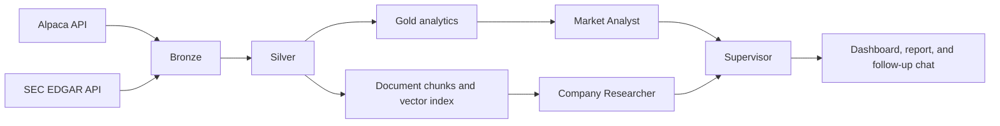

# Equity Research Copilot on Databricks

> A production-oriented portfolio project combining data engineering and AI engineering on Databricks.

**Status:** Planning and MVP development

## Overview

Equity research often requires analysts and investors to collect market prices, company fundamentals, regulatory filings, and recent news from separate sources. This project will create a small application that turns those sources into a structured, cited comparison of US equities.

The application is designed as a research assistant. It will not execute trades, predict prices, or provide financial advice.

## Target user

An individual investor or junior equity analyst who wants to research one company or compare two companies without manually assembling information from multiple systems.

## MVP

The first version will:

- Support AAPL and MSFT.
- Ingest historical market data and recent news from Alpaca.
- Ingest company fundamentals and selected filing sections from SEC EDGAR.
- Process data through Bronze, Silver, and Gold Delta tables.
- Provide structured financial analytics and document retrieval with citations.
- Coordinate a Supervisor, Market Analyst, and Company Researcher with LangGraph.
- Present results in a dashboard with follow-up chat.

The MVP will not include trading execution, price prediction, portfolio optimization, GDELT, cTrader, or live Alpaca MCP access.

## Architecture

## Expected output

A user can ask:

> Compare Apple and Microsoft over the last six months. Which had stronger market and financial performance, what recent developments matter, and what are the principal risks?

The application will return:

- Market-return, volatility, drawdown, and trend comparisons.
- Fundamental-performance comparisons.
- Relevant filing and news evidence with dates and citations.
- A concise research summary and stated limitations.
- Follow-up answers grounded in the retrieved evidence.

## Planned technology

- Databricks and Delta Lake
- Bronze-Silver-Gold architecture
- Python, PySpark, and SQL
- Alpaca Market Data and News APIs
- SEC EDGAR APIs
- LangGraph multi-agent orchestration
- Vector retrieval for filings and news
- Automated data-quality and agent evaluations

## Implementation

Development is organized into three milestones. See [PLAN.md](PLAN.md) for the working checklist.

## Disclaimer

This project is for educational and portfolio demonstration purposes. Its outputs are informational and are not investment advice.