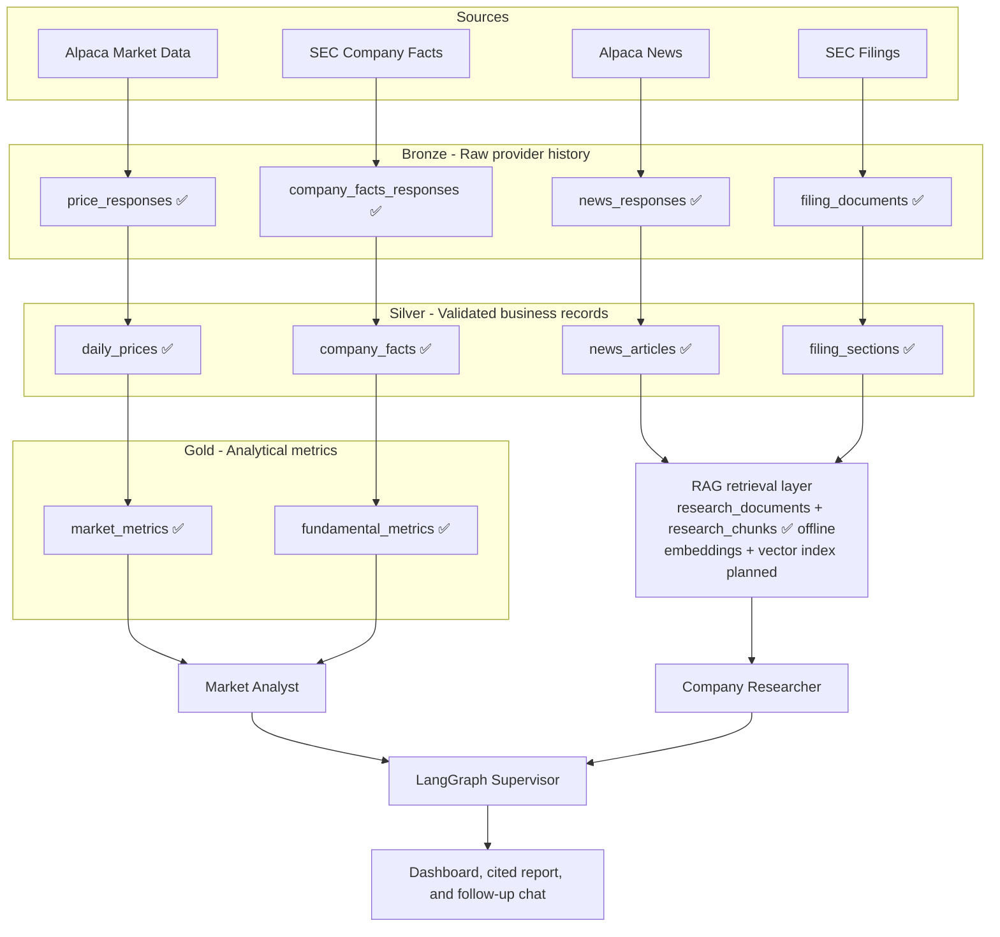

# Multi-Agent Equity Research System on Databricks

> A production-oriented portfolio project combining data engineering and AI engineering on Databricks.

**Status:** Milestone 1 — Data Engineering complete; Milestone 2 — AI Engineering in progress

## Overview

Equity research often requires analysts and investors to collect market prices, company fundamentals, regulatory filings, and recent news from separate sources. This project will create a small application that turns those sources into a structured, cited comparison of US equities.

The application is designed as a research assistant. It will not execute trades, predict prices, or provide financial advice.

## Target user

An individual investor or junior equity analyst who wants to research one company or compare two companies without manually assembling information from multiple systems.

## MVP

The first version will:

- Support AAPL and MSFT.
- Ingest historical market data and recent news from Alpaca.
- Ingest company fundamentals and selected filing sections from SEC EDGAR.
- Process data through Bronze, Silver, and Gold Delta tables.
- Provide structured financial analytics plus Retrieval-Augmented Generation (RAG) over validated news and SEC filing evidence with citations.
- Coordinate a Supervisor, Market Analyst, and Company Researcher with LangGraph.
- Present results in a dashboard with follow-up chat.

The MVP will not include trading execution, price prediction, portfolio optimization, GDELT, cTrader, or live Alpaca MCP access.

## Current progress

- **Bronze:** 4/4 MVP datasets implemented and live-verified.
- **Silver:** 4/4 MVP datasets implemented and live-verified: `daily_prices`, `news_articles`, `company_facts`, and `filing_sections`.
- **Gold:** 2/2 analytical metric tables implemented and live-verified: `market_metrics` and `fundamental_metrics`.
- **Daily market/news refresh:** scheduled at 01:00 America/New_York Tuesday-Saturday, with incremental Bronze ingestion, Silver/Gold rebuilds, and an automated quality/freshness/lineage verification gate. The first real periodic scheduler run completed successfully end-to-end.
- **Weekly SEC/fundamentals refresh:** scheduled at 02:00 America/New_York Sunday, with SEC company-facts and selected 10-K ingestion, Silver rebuilds, Gold fundamental metrics, and a final freshness/coverage/lineage verification gate. The full DAG is manually live-verified; the first periodic Sunday execution is pending.
- **Milestone 1 — Data Engineering:** complete. Bronze, Silver, Gold, CI, scheduled refresh orchestration, quality/freshness/lineage gates, safe replay behavior, and controlled deployment verification are all implemented and verified. The deployment gate was executed from the CI-tested `main` commit `caa3dcb` and completed with a converged bundle plan plus a successful serverless Spark smoke test.
- **Operational audit policy:** the MVP uses fail-before-publication validation rather than partial publication plus quarantine tables. Immutable Bronze provenance, validation diagnostics, deterministic replay, Databricks job history, and final verification gates provide the required operational evidence; dedicated row-level rejection tables are deferred until a mixed valid/invalid batch workflow requires them.
- **Milestone 2 — AI Engineering:** in progress. The RAG corpus contract is defined, and deterministic `research_documents` and `research_chunks` transformations are implemented and covered by offline tests. Embeddings, vector indexing, controlled retrieval tools, agents, and MLflow GenAI evaluation remain pending.
- Detailed implementation evidence and run links are tracked in [PLAN.md](PLAN.md).

## Architecture



Gold is intentionally **not** a one-to-one mirror of Silver. Structured price and fundamental data feed analytical Gold tables, while validated news and filing text primarily become retrieval/indexing assets for the AI layer.

## Expected output

A user can ask:

> Compare Apple and Microsoft over the last six months. Which had stronger market and financial performance, what recent developments matter, and what are the principal risks?

The application will return:

- Market-return, volatility, drawdown, and trend comparisons.
- Fundamental-performance comparisons.
- Relevant filing and news evidence with dates and citations.
- A concise research summary and stated limitations.
- Follow-up answers grounded in the retrieved evidence.

## Planned technology

- Databricks and Delta Lake
- Bronze-Silver-Gold architecture
- Python, PySpark, and SQL
- Alpaca Market Data and News APIs
- SEC EDGAR APIs
- LangGraph multi-agent orchestration
- Retrieval-Augmented Generation (RAG) with deterministic research documents/chunks, embeddings, and vector retrieval for filings and news
- Databricks Foundation Model APIs: GTE Large (En) embedding baseline, GPT OSS worker/Supervisor models
- MLflow 3 tracing and GenAI evaluation with deterministic retrieval metrics, code-based scorers, and LLM judges
- Automated data-quality and agent evaluations

## Implementation

Development follows one end-to-end workflow:

1. **Project foundations:** scope, architecture, repository, and Databricks smoke test.
2. **Data Engineering:** source contracts, Bronze/Silver/Gold pipelines, quality, scheduling, and deployment checks.
3. **AI Engineering:** retrieval and tools, the multi-agent workflow, tracing, and evaluation.
4. **Application delivery:** UI, monitoring, deployment, and reproducible demonstration.

Each milestone has a tested completion gate. See [PLAN.md](PLAN.md) for progress, [DATA_CONTRACTS.md](DATA_CONTRACTS.md) for data and RAG corpus rules, [docs/AI_RESEARCH_CONTRACT.md](docs/AI_RESEARCH_CONTRACT.md) for behavioral requirements, and [docs/MODEL_STRATEGY.md](docs/MODEL_STRATEGY.md) for model allocation, limits, chunking baselines, and MLflow evaluation strategy.

## Local Alpaca access check

This read-only check requests daily AAPL and MSFT bars for
2026-08-27 using the SIP feed, split adjustment, and USD.

The successful local check used Python 3.14.7. This is not a
Databricks runtime requirement.

### Setup — Windows PowerShell

With Python installed, run from the repository root:

```powershell
python -m venv .venv
.\.venv\Scripts\python.exe -m pip install -r requirements.txt
```

Create a `.env` file in the repository root and enter your
Alpaca paper-account credentials privately:

```dotenv
ALPACA_API_KEY=your_api_key_here
ALPACA_SECRET_KEY=your_secret_key_here
```

The `.env` file is ignored by Git. Never commit or share it.

### Run

```powershell
.\.venv\Scripts\python.exe scripts/check_alpaca_access.py
```

Expected output:

- `HTTP status: 200`
- One daily bar for AAPL and one for MSFT.
- `next_page_token: null`

Inspect all three conditions; HTTP 200 alone does not establish
sample completeness. If the check fails, investigate without
automatically switching feeds.

This check does not place trades, create tables, run on Databricks,
or validate the full data contract.

## Local Alpaca news access check

This read-only script requests one page of AAPL/MSFT news for
the fixed UTC window specified in the script: August 24–28, 2026.
It requests up to three articles, including content when available.

Reuse the dependencies and private `.env` configuration described
above. No additional credentials or packages are required.

Run from the repository root using one of these commands.

With the `.venv` setup above:

```powershell
.\.venv\Scripts\python.exe scripts/check_alpaca_news_access.py
```

With an already active environment containing the dependencies,
such as the project's local `db` environment:

```powershell
python scripts/check_alpaca_news_access.py
```

Verified sample output:

```text
HTTP status: 200
Articles returned: 3
More pages available: True
```

The remaining output shows article metadata and the types and
lengths of text fields. It does not print credentials, headlines,
summaries, or article bodies.

`More pages available: True` is expected for the verified sample:
the script intentionally inspects only the first page.

A future response may differ if provider data or access changes.
This check does not establish complete news coverage, validate
the full contract, or create Databricks tables.

See [DATA_CONTRACTS.md](DATA_CONTRACTS.md) for the documented
schema, validation rules, and content-use boundaries.

## Local SEC access checks

<details>
<summary>Setup, commands, and expected output</summary>

Reuse the Python dependencies described above. In your private
`.env`, configure a project identifier and real contact email,
replacing the placeholder locally:

```dotenv
SEC_USER_AGENT="EquityResearchLearningProject your-email@example.com"
```

Never commit `.env` or its private values. The SEC diagnostics
do not send Alpaca credentials.

From the repository root, with your project environment active:

```powershell
python scripts/check_sec_access.py
python scripts/check_sec_company_facts_access.py
```

With the documented `.venv` setup, use
`.\.venv\Scripts\python.exe` instead of `python`.

Expected results:

- Directory check: HTTP 200, AAPL CIK `0000320193`,
  and MSFT CIK `0000789019`.
- Company-facts check: HTTP 200 for each company, matching CIKs,
  concept metadata, units, observation counts, and up to two
  sample observations per inspected concept/unit.

Inspect the output; HTTP 200 alone does not validate the contract.
Counts and sample data may change. Samples follow response order
and are not a latest-value selection.

These are local, read-only source diagnostics. They do not save
response payloads, create Databricks tables, or implement the
Bronze/Silver/Gold pipeline.

</details>

## Disclaimer

This project is for educational and portfolio demonstration purposes. Its outputs are informational and are not investment advice.
