# Multi-Agent Equity Research System on Databricks

> A production-oriented end-to-end portfolio project combining Databricks data engineering, agentic AI engineering, evaluation, and application delivery.

**Status:** ✅ Milestone 1 — Data Engineering complete · ✅ Milestone 2 — AI Engineering complete · ✅ Milestone 3 — Application Delivery complete

**Live Databricks App:** [Open the deployed Equity Research Workspace](https://equity-research-dev-7474654299884940.aws.databricksapps.com/)  
*Databricks authentication and app access are required; anonymous public access is not supported by Databricks Apps.*

## Overview

Equity research often requires analysts and investors to collect market prices, company fundamentals, regulatory filings, and recent news from separate sources. This project creates a private Databricks application that turns those sources into structured, cited research over US equities.

The application is designed as a research assistant. It will not execute trades, predict prices, or provide financial advice.

## Target user

The private application is built for the project owner as an individual investor/researcher who wants to research one company or compare two companies without manually assembling information from multiple systems. The public portfolio surface is the GitHub repository, documentation, tests, selected screenshots, and a link to the live private Databricks deployment. Because Databricks Apps do not support anonymous public access, external visitors can open and test the live app only when they have been granted Databricks/app access.

## MVP

The MVP:

- Support AAPL and MSFT.
- Ingest historical market data and recent news from Alpaca.
- Ingest company fundamentals and selected filing sections from SEC EDGAR.
- Process data through Bronze, Silver, and Gold Delta tables.
- Provide structured financial analytics plus Retrieval-Augmented Generation (RAG) over validated news and SEC filing evidence with citations.
- Coordinate a Supervisor, Market Analyst, and Company Researcher with LangGraph.
- Present results in a private Databricks Dash workspace with normalized market charts, validated cited reports, publication-safe evidence provenance, session-bound grounded follow-up chat, and privacy-safe application telemetry.

The MVP will not include trading execution, price prediction, portfolio optimization, GDELT, cTrader, or live Alpaca MCP access.

## Current progress

- **Data engineering:** all four Bronze sources, four validated Silver datasets, and two analytical Gold tables are implemented and live-verified.
- **Orchestration and quality:** daily market/news and weekly SEC/fundamentals workflows include incremental ingestion, deterministic transformations, freshness/coverage/lineage gates, and safe replay behavior.
- **AI engineering:** the controlled RAG corpus and AI Search index, Gold/retrieval tools, two GPT OSS 20B workers, deterministic LangGraph Supervisor, GPT OSS 120B synthesis, citation validation, bounded repair, and deterministic fallback are implemented and live-verified.
- **Evaluation and observability:** credential-free CI, controlled live E1–E6 evaluation, MLflow application traces, numerical fidelity, grounding, relevance, safety, and publication-boundary checks are in place.
- **Application delivery:** the private Databricks Dash workspace is deployed and live-verified for single-company and AAPL/MSFT comparison research, signed grounded follow-up, fixed-category feedback, and bounded `APP_EVENT` telemetry.
- Detailed implementation evidence, run identities, and remaining operational observations are tracked in [PLAN.md](PLAN.md).

## Portfolio preview

### AAPL vs MSFT research workspace

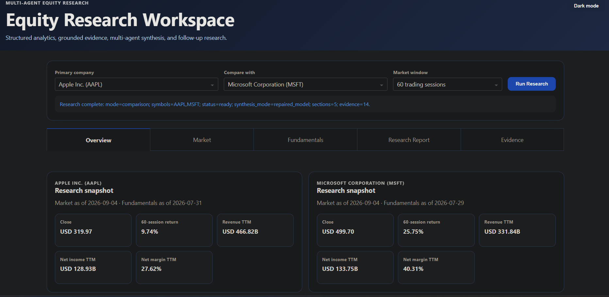

### Normalized market comparison

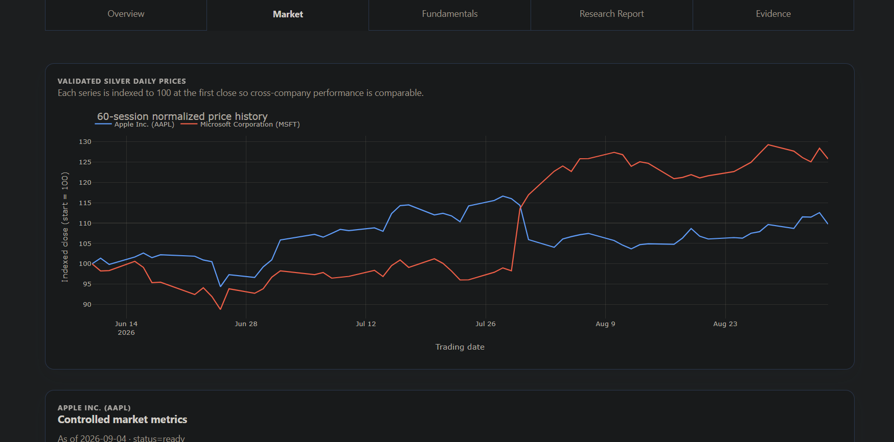

### Validated cited research report

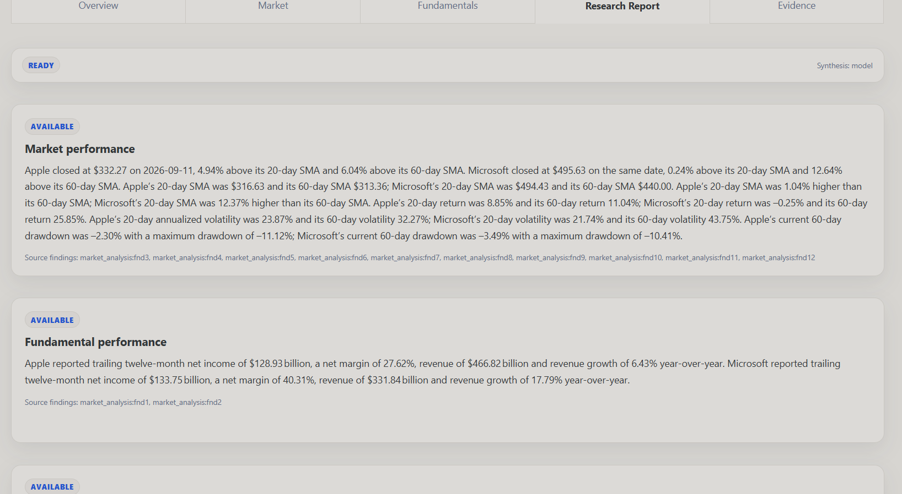

## Databricks platform architecture in practice

### Automated daily market & news pipeline

Bronze ingestion → Silver transformation → Gold market metrics → automated verification.

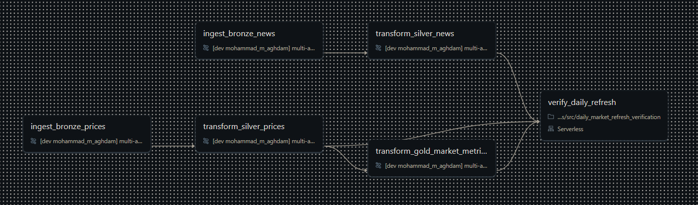

### Automated weekly fundamentals & SEC filings pipeline

Company facts + SEC filings → Silver transformations → Gold fundamentals → automated verification.

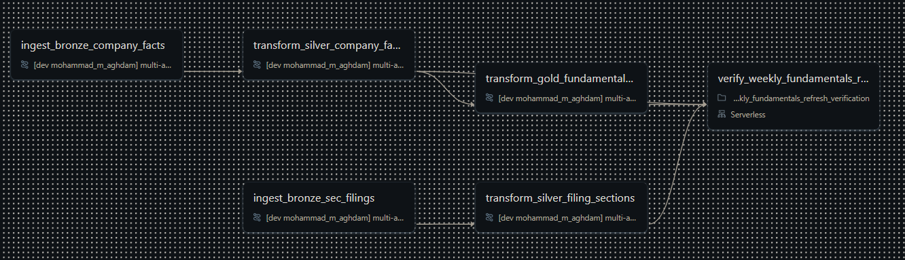

### Unity Catalog — real Bronze, Silver, Gold, and AI/RAG assets

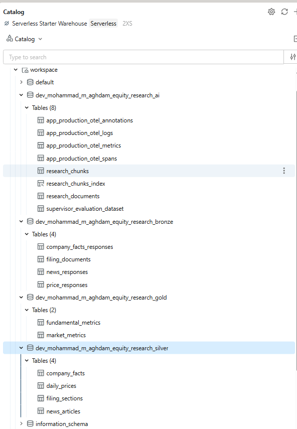

### MLflow production tracing — live application requests

Research and grounded follow-up requests from the deployed Databricks App create observable MLflow trace rows with bounded request, response, model, token, validation, and latency metadata.

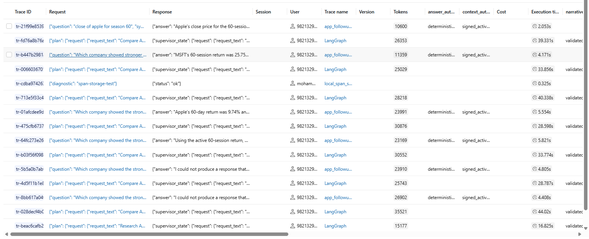

The Free Edition deployment preserves these trace metadata rows, but its current workspace-backed trace storage does not expose the complete span payloads required by production scorers. Those scorers therefore remain paused at sample rate `0`; the controlled E1/E2 evaluation below remains the authoritative scored baseline.

### MLflow GenAI evaluation — final managed E1/E2 regression baseline

The final managed evaluation run `spiffy-rat-765` (`248395fd300d449ab98d496a4a39fcdc`) keeps the full Databricks metrics table readable across four screenshots. Click any image to inspect it at full resolution.

<table>
<tr>
<td width="50%"><a href="docs/screenshots/07-mlflow-evaluation-1.png">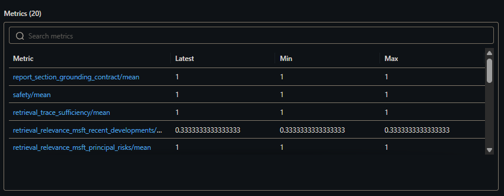</a></td>
<td width="50%"><a href="docs/screenshots/07-mlflow-evaluation-2.png">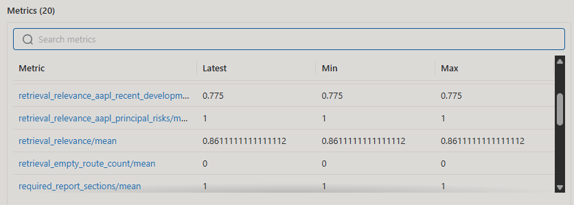</a></td>
</tr>
<tr>
<td width="50%"><a href="docs/screenshots/07-mlflow-evaluation-3.png">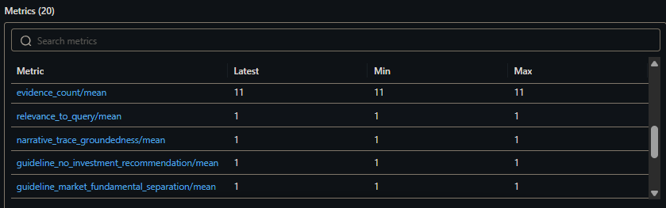</a></td>
<td width="50%"><a href="docs/screenshots/07-mlflow-evaluation-4.png">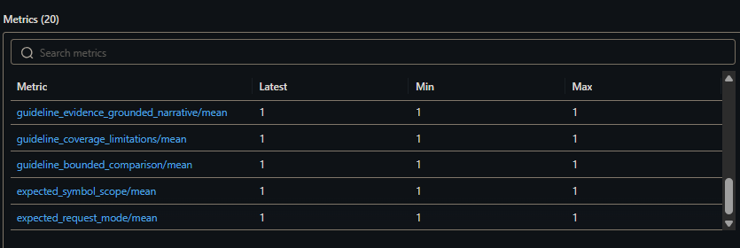</a></td>
</tr>
</table>

| Final evaluation signal | Mean |
| --- | ---: |
| Report section grounding contract | 1.000 |
| Safety | 1.000 |
| Retrieval trace sufficiency | 1.000 |
| Relevance to query | 1.000 |
| Narrative trace groundedness | 1.000 |
| Required report sections | 1.000 |
| Overall retrieval relevance | 0.861 |
| Retrieval empty-route count | 0 |

The non-perfect retrieval-relevance score is retained deliberately: the portfolio shows the measured precision/recall tradeoff rather than hiding it behind only perfect metrics.

See the [portfolio demo walkthrough](docs/PORTFOLIO_DEMO.md) for the evidence-provenance, grounded follow-up, evaluation, operations, and reproduction walkthrough.

## Architecture

<div align="center">
<pre>
                                    Sources
                                       │
                          ├─ Alpaca Market Data + News
                         └─ SEC Company Facts + Filings
                                       │
                                       ▼
                        Milestone 1 — Data Engineering ✅
                                       │
                                     Bronze
                                       │
                                       ▼
                                     Silver
                                       │
                                       ▼
                 ┌─────────────────────┴─────────────────────┐
                 │                                           │
                 ▼                                           ▼
┌─────────────────────────────────┐         ┌─────────────────────────────────┐
│           Gold metrics          │         │   RAG corpus (news + filings)   │
└─────────────────────────────────┘         └─────────────────────────────────┘
                 │                                           │
                 └─────────────────────┬─────────────────────┘
                                       │
                                       ▼
                         Milestone 2 — AI Engineering ✅
                                       │
                                       ▼
                 ┌─────────────────────┴─────────────────────┐
                 │                                           │
                 ▼                                           ▼
┌─────────────────────────────────┐         ┌─────────────────────────────────┐
│      Controlled Gold tools      │         │       Vector Search / RAG       │
└─────────────────────────────────┘         └─────────────────────────────────┘
                 │                                           │
                 ▼                                           ▼
┌─────────────────────────────────┐         ┌─────────────────────────────────┐
│   Market Analyst · GPT OSS 20B  │         │ Company Researcher · GPT OSS 20B│
└─────────────────────────────────┘         └─────────────────────────────────┘
                 │                                           │
                 └─────────────────────┬─────────────────────┘
                                       │
                                       ▼
                              LangGraph Supervisor
                                       │
                                       ▼
                                  GPT OSS 120B
                                       │
                                       ▼
                            Deterministic validation
                         Numeric fidelity / provenance
                               Repair + fallback
                                       │
                                       ▼
                             Grounded cited report
                                       │
                                       ▼
                 ┌─────────────────────┴─────────────────────┐
                 │                                           │
                 ▼                                           ▼
┌─────────────────────────────────┐         ┌─────────────────────────────────┐
│          MLflow traces          │         │        MLflow evaluation        │
└─────────────────────────────────┘         └─────────────────────────────────┘
                 │                                           │
                 └─────────────────────┬─────────────────────┘
                                       │
                                       ▼
                                CI / regression
                                       │
                                       ▼
                         Milestone 3 — Databricks App ✅
                   Charts · cited report · grounded follow-up
           GPT OSS 120B follow-up over signed active research context
</pre>
</div>

Gold is intentionally **not** a one-to-one mirror of Silver. Structured price and fundamental data feed analytical Gold tables, while validated news and filing text primarily become retrieval/indexing assets for the AI layer.

## Expected output

A user can ask:

> Compare Apple and Microsoft over the last six months. Which had stronger market and financial performance, what recent developments matter, and what are the principal risks?

The application returns:

- Market-return, volatility, drawdown, and trend comparisons.
- Fundamental-performance comparisons.
- Relevant filing and news evidence with dates and citations.
- A concise research summary and stated limitations.
- Follow-up answers grounded in the retrieved evidence.

## Technology

- Databricks and Delta Lake
- Bronze-Silver-Gold architecture
- Python, PySpark, and SQL
- Alpaca Market Data and News APIs
- SEC EDGAR APIs
- LangGraph multi-agent orchestration
- Retrieval-Augmented Generation (RAG) with deterministic research documents/chunks, embeddings, and vector retrieval for filings and news
- Databricks Foundation Model APIs: GTE Large (En) embedding baseline, GPT OSS 20B workers, GPT OSS 120B terminal synthesis
- MLflow 3 tracing and GenAI evaluation with deterministic retrieval metrics, code-based scorers, and LLM judges
- Automated data-quality and agent evaluations

## Implementation

Development follows one end-to-end workflow:

1. **Project foundations:** scope, architecture, repository, and Databricks smoke test.
2. **Data Engineering:** source contracts, Bronze/Silver/Gold pipelines, quality, scheduling, and deployment checks.
3. **AI Engineering:** retrieval and tools, the multi-agent workflow, tracing, and evaluation.
4. **Application delivery:** private Databricks App, controlled presentation adapters, signed follow-up sessions, privacy-safe telemetry, publication audit, deployment verification, and reproducible portfolio demonstration.

Each milestone has a tested completion gate. See [PLAN.md](PLAN.md) for progress, [DATA_CONTRACTS.md](DATA_CONTRACTS.md) for data and RAG corpus rules, [docs/AI_RESEARCH_CONTRACT.md](docs/AI_RESEARCH_CONTRACT.md) for behavioral requirements, [docs/MODEL_STRATEGY.md](docs/MODEL_STRATEGY.md) for model allocation and evaluation strategy, [docs/EVALUATION_RUNBOOK.md](docs/EVALUATION_RUNBOOK.md) for the credential-free versus credentialed evaluation boundary, [docs/APP_DESIGN.md](docs/APP_DESIGN.md) for the application product/runtime design, [docs/APP_OPERATIONS.md](docs/APP_OPERATIONS.md) for telemetry and secure-runtime operations, [docs/APP_RELEASE_RUNBOOK.md](docs/APP_RELEASE_RUNBOOK.md) for release/reproduction checks, [docs/PORTFOLIO_DEMO.md](docs/PORTFOLIO_DEMO.md) for the concise employer-facing walkthrough, [docs/REPOSITORY_GUIDE.md](docs/REPOSITORY_GUIDE.md) for the component map, and [docs/DATA_USAGE_PERMISSIONS.md](docs/DATA_USAGE_PERMISSIONS.md) for the private-runtime/public-portfolio publication boundary.

## Local Alpaca access check

This read-only check requests daily AAPL and MSFT bars for
2026-08-27 using the SIP feed, split adjustment, and USD.

The successful local check used Python 3.14.7. This is not a
Databricks runtime requirement.

### Setup — Windows PowerShell

With Python installed, run from the repository root:

```powershell
python -m venv .venv
.\.venv\Scripts\python.exe -m pip install -r requirements.txt
```

Create a `.env` file in the repository root and enter your
Alpaca paper-account credentials privately:

```dotenv
ALPACA_API_KEY=your_api_key_here
ALPACA_SECRET_KEY=your_secret_key_here
```

The `.env` file is ignored by Git. Never commit or share it.

### Run

```powershell
.\.venv\Scripts\python.exe scripts/check_alpaca_access.py
```

Expected output:

- `HTTP status: 200`
- One daily bar for AAPL and one for MSFT.
- `next_page_token: null`

Inspect all three conditions; HTTP 200 alone does not establish
sample completeness. If the check fails, investigate without
automatically switching feeds.

This check does not place trades, create tables, run on Databricks,
or validate the full data contract.

## Local Alpaca news access check

This read-only script requests one page of AAPL/MSFT news for
the fixed UTC window specified in the script: August 24–28, 2026.
It requests up to three articles, including content when available.

Reuse the dependencies and private `.env` configuration described
above. No additional credentials or packages are required.

Run from the repository root using one of these commands.

With the `.venv` setup above:

```powershell
.\.venv\Scripts\python.exe scripts/check_alpaca_news_access.py
```

With an already active environment containing the dependencies,
such as the project's local `db` environment:

```powershell
python scripts/check_alpaca_news_access.py
```

Verified sample output:

```text
HTTP status: 200
Articles returned: 3
More pages available: True
```

The remaining output shows article metadata and the types and
lengths of text fields. It does not print credentials, headlines,
summaries, or article bodies.

`More pages available: True` is expected for the verified sample:
the script intentionally inspects only the first page.

A future response may differ if provider data or access changes.
This check does not establish complete news coverage, validate
the full contract, or create Databricks tables.

See [DATA_CONTRACTS.md](DATA_CONTRACTS.md) for the documented
schema, validation rules, and content-use boundaries.

## Local SEC access checks

<details>
<summary>Setup, commands, and expected output</summary>

Reuse the Python dependencies described above. In your private
`.env`, configure a project identifier and real contact email,
replacing the placeholder locally:

```dotenv
SEC_USER_AGENT="EquityResearchLearningProject your-email@example.com"
```

Never commit `.env` or its private values. The SEC diagnostics
do not send Alpaca credentials.

From the repository root, with your project environment active:

```powershell
python scripts/check_sec_access.py
python scripts/check_sec_company_facts_access.py
```

With the documented `.venv` setup, use
`.\.venv\Scripts\python.exe` instead of `python`.

Expected results:

- Directory check: HTTP 200, AAPL CIK `0000320193`,
  and MSFT CIK `0000789019`.
- Company-facts check: HTTP 200 for each company, matching CIKs,
  concept metadata, units, observation counts, and up to two
  sample observations per inspected concept/unit.

Inspect the output; HTTP 200 alone does not validate the contract.
Counts and sample data may change. Samples follow response order
and are not a latest-value selection.

These are local, read-only source diagnostics. They do not save
response payloads, create Databricks tables, or implement the
Bronze/Silver/Gold pipeline.

</details>

## Disclaimer

This project is for educational and portfolio demonstration purposes. Its outputs are informational and are not investment advice.

## License

This project is licensed under the [MIT License](LICENSE).
